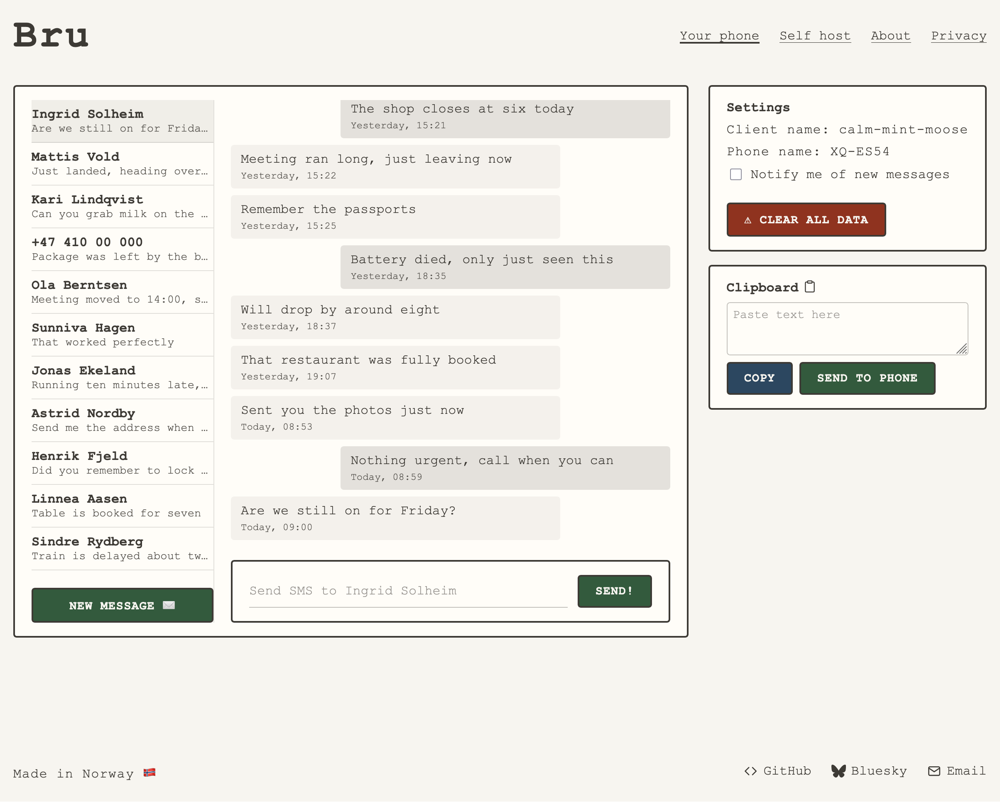

+++
weight=120
title="Bru: Send and read SMS from the browser"
date="2026-09-30"
description="Because life is too short to type on a phone."
+++

Short version: [Bru](https://bru.works) is an Android app and web client that lets you read and send SMS messages from your browser, via your phone. It is currently available from the [IzzyOnDroid](https://apt.izzysoft.de/fdroid/index/apk/works.bru) app repository, but hopefully soon on F-Droid, and possibly Google Play.

I used:
* Plain HTML, JavaScript and CSS
* Rust 
* [Iroh](https://iroh.computer), as WASM in the browser, and via the available Kotlin bindings
* Kotlin

## Longer version

Since the start of the summer this year I have tinkered with [Bru](https://bru.works). The **b**idirectional **r**emote **u**plink for your Android phone. *Bru* is also the  Norwegian word for _bridge_. And yes, the name is of course a backronym. Since I started using a T9 phone as my daily driver, I have more than once wished I could break out into a full qwerty keyboard when typing out long messages or having a longer conversation. Don't get me wrong, I love the tactile buttons, but for me, nothing beats an actual keyboard when writing. Another thing I wanted to solve was that every SMS was a prompt to take my phone out, opening the door for endless distractions. And yes, this could have been solved with notification settings, self discipline and yada yada...

## Maybe I should not reinvent the wheel?

>The best code is no code at all. Every new line of code you willingly bring into the world is code that has to be debugged, code that has to be read and understood, code that has to be supported. Every time you write new code, you should do so reluctantly, under duress, because you completely exhausted all your other options.
>
> — Jeff Atwood

While my first instinct was "oooh I can build thing", I recognized that this might be a problem others have had and solved before me. I did some searching, and tested some alternatives. It is quite possible I have left out several good candidates, but these are the ones I looked at.

### Google Messages
The default SMS app from Google actually has a "Device pairing" option. Sign in to [https://messages.google.com/web](https://messages.google.com/web) and pair your phone, and it works pretty well. But for one, it is limited to the Google app, and I have (_very_) gradually tried to limit my reliance on big G. With that said, my only real gripe is that you have to re-pair very frequently. Often enough that during my limited testing I was quite annoyed. But if you are using Google Messages anyway, this might be the right solution for you.

### KDE Connect
Sigh. I really wanted this to be the solution. The ambitions are great. KDE is great! Open source! It even has a MacBook client, being a Linux-adjacent project. But I could not get it to work reliably. The pairing process was buggy. Sometimes connectivity would break, even with the phone and laptop on the same network. I found the options for configuration overwhelming, and in good Linux-fashion, there is ample room for some UX improvements. But the biggest problem was that I found the whole experience ... clunky? For all I know the Linux client is leaps and bounds better than the Mac one, though. Maybe this is the right solution for you?

### Pushbullet
Pushbullet has been around for a long time. And to be fair, I didn't really give them a fair chance. I tried it years ago, and found it aggravatingly unreliable and buggy. Dropped notifications, SMSes reported as "sent" never ended up actually sent, messages I had already answered suddenly triggering notifications again. Things may have improved, I didn't bother to check. I am listing it here for completeness' sake.

## A wheelwright I shall be
Okay, so I might have really wanted to build this thing just for the sake of it, regardless of the alternatives.

I decided on some goals for the project:

* Free as in beer, free as in speech.
* No account or user profile. No saving anything about anyone.
* No backend service (except the relays).
* Messages should be end-to-end encrypted (duh).
* Keep dependencies to a minimum. 
* No web framework for the client.
* Ideally it should be self-hostable.
* No agentic coding. I have used Claude as a rubber duck/documentation know-it-all/security reviewer. 

I started out with the obvious problem: how can I get the phone and the browser to talk to each other? Being familiar with WireGuard, I first thought about baking that into an app on the phone that could serve a REST(ish) endpoint that a client on the same network could access. As an easy way to start prototyping I installed Tailscale on my phone and on my laptop, as Tailscale is WireGuard under the hood, and gives you a stable IP address for the devices on the network. The architecture at that point was polling based, the web client would poll the server running on the phone periodically and look for new messages. While I had a nagging feeling that this might not be optimal for many reasons (battery life on the phone for one) I just wanted something that worked to iterate on. 

After some evenings of hitting my head against the wall that is Android development I had a rudimentary app working, running in the background on the phone and serving the available SMS threads, secured with a hard-coded token just in case. With that in place I could start working on a client.

## Back to the basics
As stated, I wanted to build this as a statically hosted web app, and without any web framework. I wanted to get a feel for how it is to develop like this in 2026. Having relied almost solely on React professionally, and SvelteKit in my spare time, I wanted to do something different. I first imagined the client as a typewriter with the paper sticking out of the top sort of thing, but ended up turning the skeuomorphism down a few notches. I kept the monospaced Courier font and off-white though.

The client is built as `index.html` files in a folder hierarchy, an increasingly unmaintainable `style.css` and typed JavaScript with ESM modules and custom elements for the reused components like header and footer. This does mean the components are rendered client side instead of being baked into prerendered static pages which I would have preferred. There are no architectures without tradeoffs, and the alternative would have been to copy-paste the shared code across several pages and remembering to keep them in sync. Not horroble, but not great either.

## Tin cans on string
While the prototype worked, there were some things I needed to figure out. For my own personal use, depending on Tailscale as an additional app was not a problem, but it would greatly reduce the number of other people that would bother to install it. And while solving problems for myself is enough by itself, creating something that others might find useful as well is very rewarding. Embedding the WireGuard tunnel library seemed like a logical step, but before I started on that, I found Iroh.

Sometimes the stars align. A post announcing Iroh 1.0.0 came up in one of my feeds, and I knew this could be the right fit. In essence, Iroh is a dumb pipe. You put stuff in at one end, it comes out the other. "Dial keys, not IPs" is the mantra. And being built with Rust, it works in the browser when compiled to WebAssembly. And with the Android SDK available, it was exactly what I needed.

Iroh works by establishing a direct peer-to-peer connection between your devices. It does this with the help of relays, servers that both devices can reach. When a device starts up, it connects to a relay. When one device wants to talk to another, they first swap addresses through the relay. Then both start firing packets at each other at the same time. Each router sees the incoming traffic as a reply to something it sent out itself, and lets it through. This is called hole punching, and works in most network topologies. When it doesn't, say on a locked-down corporate network, the traffic is forwarded via the relay.

Browsers aren't allowed to send raw UDP packets, so hole punching isn't possible there, and the Bru web client always goes through a relay. The connection is still end-to-end encrypted, so the relay can't read your messages. A desktop application, or a terminal based one, would be able to do actual peer-to-peer communication.

The juicy center of the client, the Iroh-related code, is written in Rust and compiled to WebAssembly with `wasm-pack`. The module exposes a single `Bru` struct that the JavaScript code can use. It has methods for opening a connection, sending and receiving data, health checks and so on. Having wasm-pack generate the bindings and glue code makes using WebAssembly as easy as any other JS module.

## Self hosting and hacking
Since the Iroh relay is open source and can be run on whatever server you want, and the client is simple static files, the whole stack can be self-hosted if one is so inclined. There is a settings menu in both the client and the Android app to configure the relay in use.

The "protocol" is also open, and there is no reason why a user could not build their own client. I am hoping someone will. Maybe a CLI, desktop app, AI agent integration (or maybe that is not a good idea?) or maybe something completely different. If I get the drive to do it, I might extract the relevant code into a self-contained library others can use.