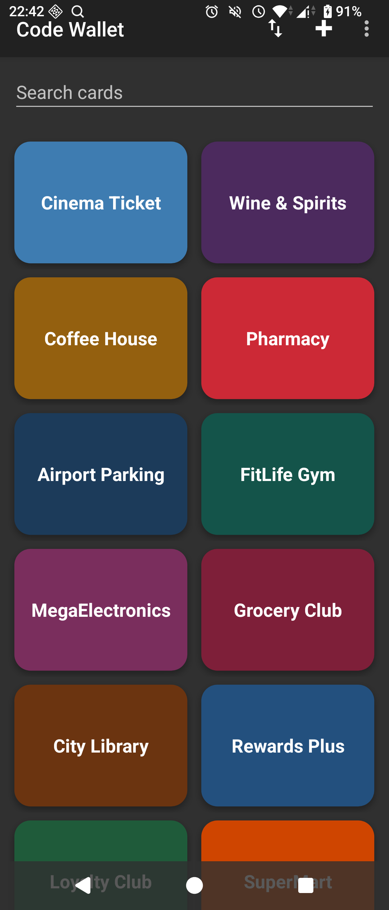
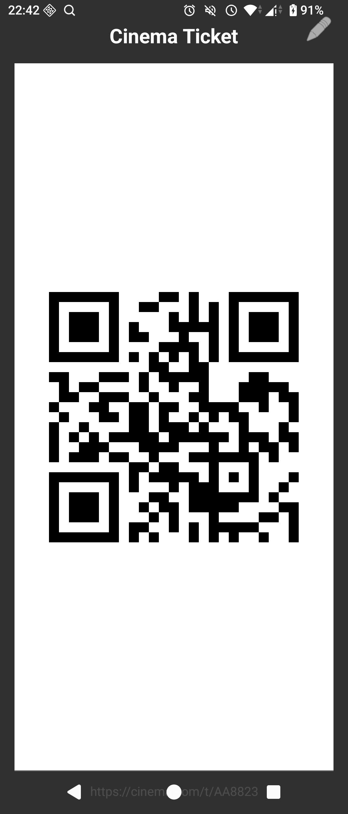

+++
weight=110
title="Code Wallet: My first published android app"
date="2026-07-30"
description="How solving a problem for myself ended up with a published app"
+++

**Short version:** I built a simple and small Android app for storing barcodes and QR codes on my phone. 

* [Google Playstore](https://play.google.com/store/apps/details?id=me.sverre.codewallet)

## Long version

In January this year I started using a "dumber" Android phone as my main phone. A Duoqin F21 Pro, running DumberOS (A lineage fork based on Android 14). I still intend to write a blog post about it and my experiences, but I have procrastinated that for more than six months and see no reason to stop now. Most apps I used before work surprisingly well, but as the phone does not have a NFC chip, Google Wallet is a no-go. Which is completely fine, as I am very slowly trying to pull my life out of Big G's clammy hands. But a genuinely useful feature of Google Wallet is adding all your loyalty cards and similar in the app. I find it very convenient to have everything in one app instead of one per store.

I found myself wanting an alternative, but every app I tried either sucked, tried to do everything, was bloated with ads or just plainly unusable on my new phone. So I ended up making my own. I haven't touched Android development for over 13 years, but I have used Kotlin professionally, and after asking Claude to scaffold me an Android app with Gradle and all that faff I loathe, I was off to the races. 

## Small

One of my biggest gripes with the alternatives I surveyed was that they all were in the range of several megabytes in size, some up to 50 megabytes. My first and most important goal with this project was that the app would be less than one megabyte. Keeping the used dependencies to a minimum is an increasingly important factor in software development these days, so this would be a win in several ways. The only dependency is ZXing, for the actual barcode encoding and decoding, since reinventing that particular wheel was a bridge too far (although probably an interesting project in its own right...).

The finished app weighs in at **211 KB**, and this pleases me quite a lot.

## Fast

The other design goal of this project was making the app fast. The F21 Pro is very limited hardware-wise, and standing in the checkout and then having to wait for the blasted codes to load was something I wanted to avoid. Researching techniques to make apps fast was a rabbit hole, but since the feature scope was quite limited, and I also made it lightweight via the size goal, there was not a whole lot I could tune. 

The `Application` class does essentially nothing on startup: the repository (and the SQLite file behind it) is opened lazily, so the database isn't touched until the first screen actually queries it, after the first frame is already on screen. `onCreate()` in the launcher activity just inflates the layout and wires up listeners, the actual data loading happens in `onResume()`, so nothing blocks the first paint.

## Testing hurdles

Having used the app myself for a while, and feeling pretty good about it, I figured I might as well publish it on Google Play (and eventually F-Droid, I just have to figure out how.) Turns out that writing the app was the easy part. The song and dance of publishing wants a privacy policy (for an app with no internet permission where everything stays on your device...), screenshots in several shapes and sizes, a content rating questionnaire, and a closed testing period with a minimum of 12 active testers held for a minimum of 14 days before it lets you go public. The play console is a masterclass in poor UX design, and while not as horrible as the GCP console, it is a close second. Google seems to assume that developers do not need good UX.

Google is also incredibly nebulous about the testing phase, as what constitutes an "active" tester is not explained anywhere. Word on the street is that the testers need to test the app for at least 15 seconds each day in order to qualify. And even if you do complete the testing, you still might be required to test the app further. As my app is very small in scope, testing it that much for two weeks feels utterly silly. The whole thing can be explored in two minutes. Add to this that I would be hard pressed to count 12 friends that are Android users AND would be willing to spend time every day to test my app AND are tech savvy enough to opt into the testing process, I ended up looking for alternatives.

There is of course a [subreddit](https://www.reddit.com/r/AndroidClosedTesting/) for this, but my post advertising for testers had very limited response. I did, however, come across an app called *App Hive* which aims to tackle this problem by grouping users into "hives" of 17 (there will be some dropouts) users where everyone is required to test the other users' apps each day for 14 days. While extremely tedious, this worked well enough and I was finally approved for production. Hooray 🎉 

I get that some sort of filter is needed with the (probable) influx of low-effort AI generated apps and malware. But I feel the process should be a lot simpler to understand, and that it should be graded based on the size of the app, the permissions it require or other factors. I dread having to go through the hoops again, should another app idea pop up.
