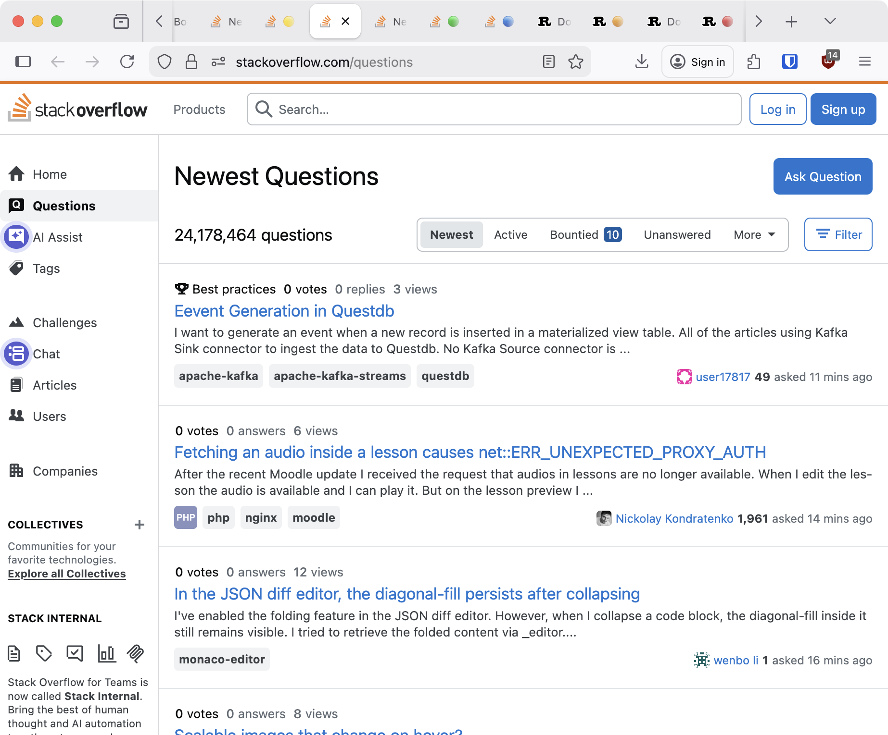
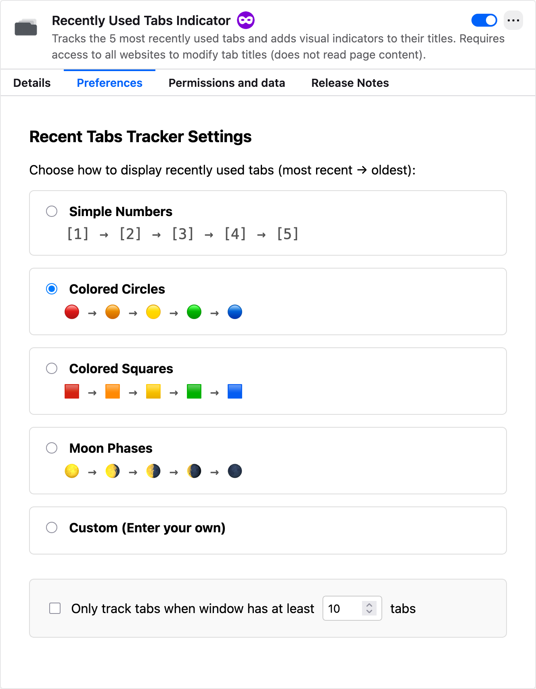

+++
title="Firefox Extension: Recently Used Tabs Indicator"
weight=90
date="2026-01-17"
+++

I made a Firefox extension to make my life a tiny bit easier. I have dabbled in this before, but I have never published one.

I have a problem with tabs. I often end up with too many open, and often several from the same site. So when I switch to a different tab to check something, and I want to go back, I am stuck scanning through a sea of tiny favicons trying to remember which one I were just on, as the title becomes truncated.

So I made a Firefox extension that tracks the 5 most recently used tabs and adds visual indicators to the start of the titles. The most recent tab gets a red circle 🔴, the next one an orange circle 🟠, and so on. This makes them stand out and easy to spot.

The extension is available on the [Firefox Add-ons store](https://addons.mozilla.org/en-US/firefox/addon/recently-used-tabs-indicator/), and the code is on [GitHub](https://github.com/sverrejb/fruti).

And yes, I know that Firefox has an option to have `ctrl`+`tab` cycle through recently open tabs, but I have never gotten used to using that for some reason. That is probably the best solution, but it is nice to have options.

## How it works

A background script tracks tab activation events per window and maintains a recency list. When you switch tabs, it sends messages to content scripts that modify the document titles by adding prefix indicators. Each browser window maintains its own independent tracking.

There are several indicator styles to choose from: simple numbers, colored circles, colored squares, moon phases, or define your own custom indicators.

Ideally I wanted to rather color the the tabs with different hues, or add some other kind of styling, but this is currently not possible, and [the issue](https://bugzilla.mozilla.org/show_bug.cgi?id=1320585) on this possible feature is nine years old...

## Permissions

The extension requires access to all websites to modify tab titles, which looks scary in the permissions prompt. The code only reads `document.title` and adds a prefix, nothing invasive. But browsers do not have a more granular permission for just modifying titles. 

Tabs that are already open when you install or reload the extension will not get indicators until you navigate somewhere. This is because content scripts are automatically injected only when pages load.

